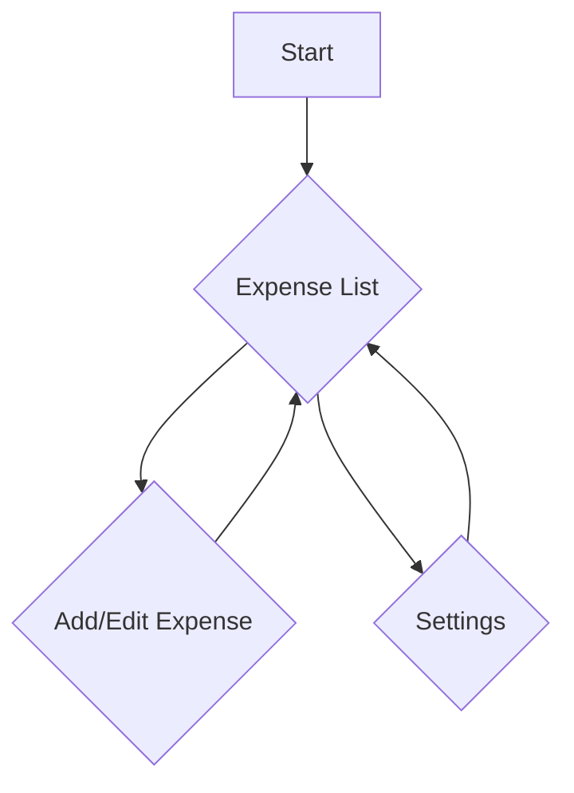
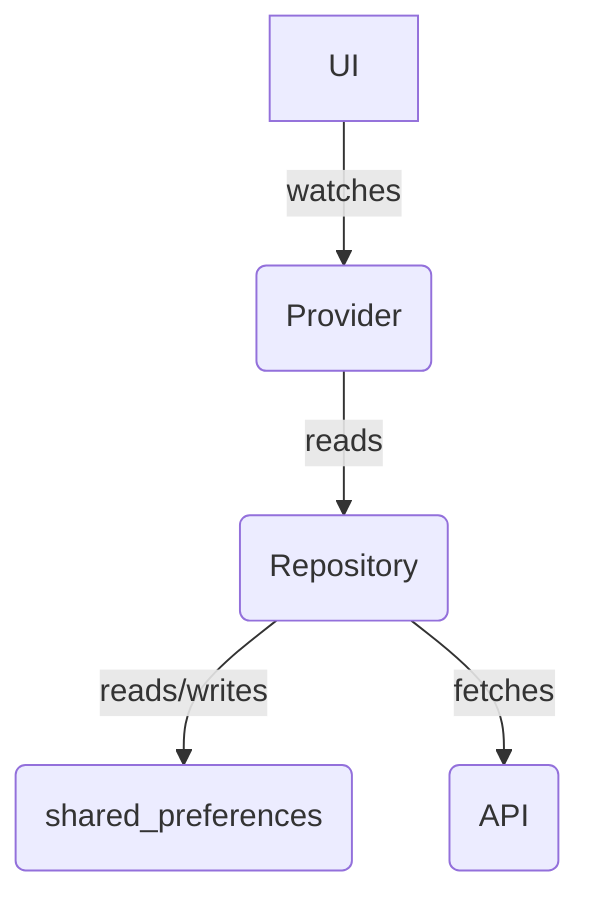

# DESIGN.md

## Overview

This document outlines the design for a "Daily Expense Tracker" Flutter application. The app will allow users to log their daily expenses, view a summary of their spending, and track exchange rates. It is designed to be a simple, user-friendly tool for people who need to keep an eye on their expenses while traveling or living abroad.

The app will be built using a modern Flutter stack, including:

- **State Management:** Riverpod
- **Navigation:** GoRouter
- **UI:** Material Design with `TextFormField` for forms
- **Internationalization:** `intl` for currency and date formatting
- **Local Storage:** `shared_preferences` for persisting data
- **Networking:** `http` for fetching exchange rates
- **Serialization:** `json_serializable` for data modeling

## Detailed Analysis

The core problem the app solves is the need for a simple way to track daily expenses and understand them in a user's home currency. This is particularly useful for travelers and expatriates who are dealing with foreign currencies.

### Key Features

- **Expense Logging:** Users can add new expenses with a title, amount, and category.
- **Expense List:** The app will display a list of today's expenses, along with the total amount for the day.
- **Expense Editing:** Users can edit existing expenses.
- **Currency Conversion:** The app will fetch the latest exchange rates and can display totals in the user's preferred currency.
- **Currency Selection:** Users can choose their home currency from a list of options.
- **Local Persistence:** All data will be stored locally on the device, so the app can be used offline.

## Alternatives Considered

### State Management

- **Provider:** While Riverpod is built on top of Provider, we chose Riverpod for its compile-time safety and improved testability.
- **Bloc:** Bloc is a powerful state management library, but for a small-scale application like this, Riverpod offers a simpler and more concise API.

### Local Storage

- **Hive:** Hive is a fast, lightweight NoSQL database for Flutter. While it's a great option for more complex data, `shared_preferences` is sufficient for our needs and has a simpler API for key-value data.
- **sqflite:** For a more traditional relational database, `sqflite` is the go-to option. However, it adds a lot of complexity that is not necessary for this app.

## Detailed Design

### Architecture

The app will follow a feature-based architecture, with each feature (e.g., expenses, settings) having its own directory containing the relevant widgets, providers, and models.

```
lib/
|-- src/
|   |-- features/
|   |   |-- expenses/
|   |   |   |-- data/
|   |   |   |   |-- expense_model.dart
|   |   |   |   |-- expense_repository.dart
|   |   |   |-- presentation/
|   |   |   |   |-- add_edit_expense_screen.dart
|   |   |   |   |-- expense_list_screen.dart
|   |   |   |-- providers/
|   |   |       |-- expense_providers.dart
|   |   |-- settings/
|   |       |-- data/
|   |       |   |-- settings_model.dart
|   |       |   |-- settings_repository.dart
|   |       |-- presentation/
|   |       |   |-- settings_screen.dart
|   |       |-- providers/
|   |           |-- settings_providers.dart
|   |-- core/
|       |-- routing/
|       |   |-- app_router.dart
|       |-- services/
|           |-- api_service.dart
|-- main.dart
```

### UI

The UI will be built using Material Design widgets.

- **Expense List Screen:** A `Scaffold` with a `ListView` to display the expenses, a `FloatingActionButton` to add a new expense, and a summary section at the top to show the total for the day.
- **Add/Edit Expense Screen:** A `Scaffold` with a `Form` containing `TextFormField` widgets for the title and amount, and a `DropdownButtonFormField` for the category.

### State Management

We will use Riverpod for state management.

- **`StateNotifierProvider`:** To manage the list of expenses. The `ExpenseRepository` will be responsible for fetching and saving the expenses, and the `StateNotifierProvider` will hold the state.
- **`Provider`:** To provide the `ExpenseRepository` and other services to the rest of the app.
- **`FutureProvider`:** To fetch the exchange rate from the API.

### Navigation

We will use GoRouter for navigation.

- **`/`:** The home screen, which will display the list of expenses.
- **`/add`:** The screen for adding a new expense.
- **`/edit/:id`:** The screen for editing an existing expense.
- **`/settings`:** The screen for changing the user's currency.

### Data Persistence

We will use `shared_preferences` to store the user's expenses and settings.

- The `ExpenseRepository` will be responsible for saving and retrieving the list of expenses.
- The `SettingsRepository` will be responsible for saving and retrieving the user's preferred currency.

### Data Modeling

We will use `json_serializable` to create our data models.

```dart
import 'package:json_annotation/json_annotation.dart';

part 'expense.g.dart';

@JsonSerializable()
class Expense {
  final String id;
  final String title;
  final double amount;
  final DateTime date;
  final String category;

  Expense({
    required this.id,
    required this.title,
    required this.amount,
    required this.date,
    required this.category,
  });

  factory Expense.fromJson(Map<String, dynamic> json) => _$ExpenseFromJson(json);

  Map<String, dynamic> toJson() => _$ExpenseToJson(this);
}
```

## Diagrams

### App Flow



### State Management



## Summary

The design for the "Daily Expense Tracker" app is based on a modern Flutter stack that is well-suited for a small-scale application. The feature-based architecture will help to keep the code organized and maintainable. The use of Riverpod, GoRouter, and `json_serializable` will help to reduce boilerplate and improve developer productivity.

## References

- [Riverpod Documentation](https_riverpod.dev_)
- [GoRouter Documentation](https_pub.dev_packages_go_router_)
- [intl Documentation](https_pub.dev_packages_intl_)
- [shared_preferences Documentation](https_pub.dev_packages_shared_preferences_)
- [http Documentation](https_pub.dev_packages_http_)
- [json_serializable Documentation](https_pub.dev_packages_json_serializable_)

